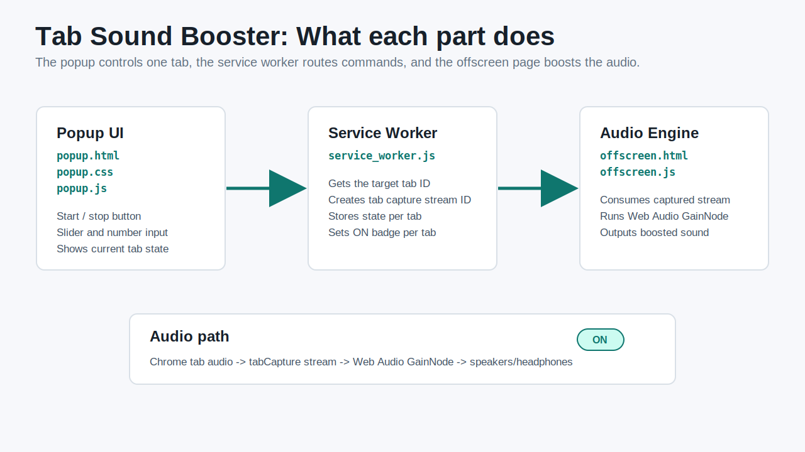
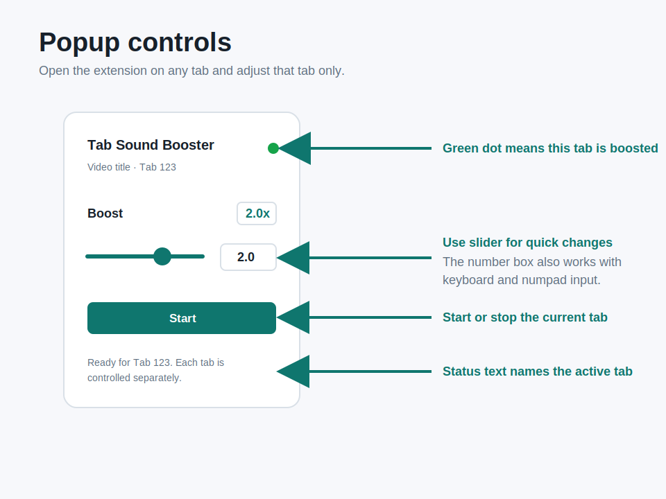
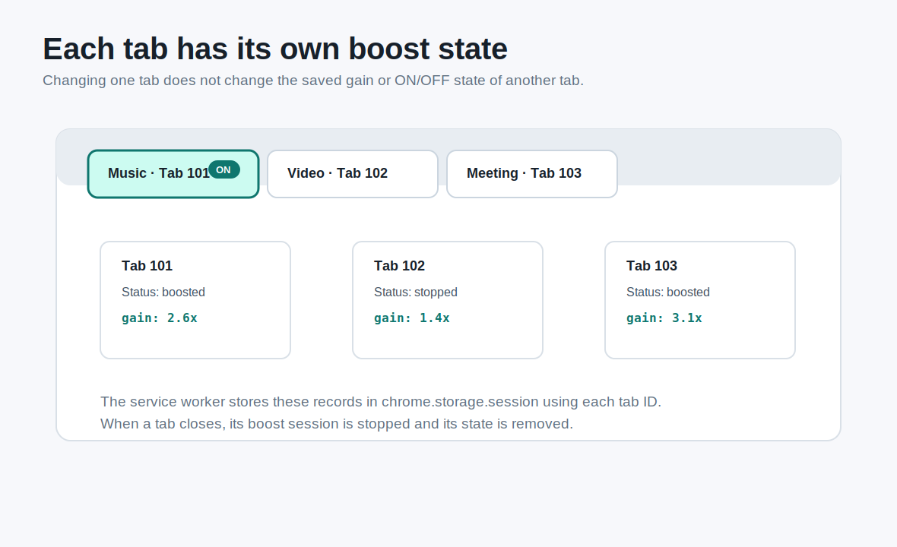

# Tab Sound Booster

Chrome extension that boosts the audio of the current tab.

## Visual guide

## Install locally

1. Open `chrome://extensions`.
2. Turn on **Developer mode**.
3. Click **Load unpacked**.
4. Select this folder: `C:\Users\swon7\OneDrive\문서\New project 5`.

## Use

1. Open a tab that is playing audio.
2. Click the extension icon.
3. Choose a boost amount and click **시작**.
4. Click **중지** to restore normal tab audio.

Chrome may show a tab capture indicator while boosting audio. The captured tab's original audio is routed through the extension, so the gain slider controls what you hear.
